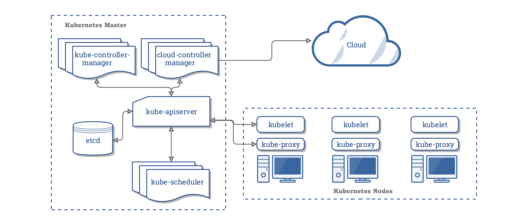

# 101 Kubernetes

## Goals
In 2019, Kubernetes was promoted in the IT market as the defacto solution to deploy on cloud.

This repo tries to solve some questions for the `Average Joe`

## Contents

- What is Kubernetes?
- Kubernetes architecture
- Kubernetes in the developer environment
- Kubernetes CLI
- YAML
- HA Clusters

### What is Kubernetes?

Kubernetes (commonly stylized as k8s) is an open-source container-orchestration system 
for automating application deployment, scaling, and management.

### Kubernetes architecture



https://kubernetes.io/docs/concepts/overview/components/

- Master Components
  - kube-apiserver
  - etcd
  - kube-scheduler
  - kube-controller-manager
  - cloud-controller-manager
- Node Components
  - kubelet
  - kube-proxy
  - Container Runtime

### Kubernetes in the developer environment

#### Micro8s

**OSX**

https://ubuntu.com/blog/kubernetes-on-mac-how-to-set-up

```
brew cask install multipass
sudo multipass set local.driver=virtualbox
multipass launch --name microk8s-vm --mem 4G --disk 40G
multipass exec microk8s-vm -- sudo snap install microk8s --classic     
multipass exec microk8s-vm -- sudo iptables -P FORWARD ACCEPT
```

#### Minikube

**OSX**

```
brew install minikube
minikube start
```

```gherkin
$ minikube
Minikube is a CLI tool that provisions and manages single-node Kubernetes clusters optimized for development workflows.

Basic Commands:
  start          Starts a local kubernetes cluster
  status         Gets the status of a local kubernetes cluster
  stop           Stops a running local kubernetes cluster
  delete         Deletes a local kubernetes cluster
  dashboard      Access the kubernetes dashboard running within the minikube cluster

Images Commands:
  docker-env     Sets up docker env variables; similar to '$(docker-machine env)'
  cache          Add or delete an image from the local cache.

Configuration and Management Commands:
  addons         Modify minikube's kubernetes addons
  config         Modify minikube config
  profile        Profile gets or sets the current minikube profile
  update-context Verify the IP address of the running cluster in kubeconfig.

Networking and Connectivity Commands:
  service        Gets the kubernetes URL(s) for the specified service in your local cluster
  tunnel         tunnel makes services of type LoadBalancer accessible on localhost

Advanced Commands:
  mount          Mounts the specified directory into minikube
  ssh            Log into or run a command on a machine with SSH; similar to 'docker-machine ssh'
  kubectl        Run kubectl

Troubleshooting Commands:
  ssh-key        Retrieve the ssh identity key path of the specified cluster
  ip             Retrieves the IP address of the running cluster
  logs           Gets the logs of the running instance, used for debugging minikube, not user code.
  update-check   Print current and latest version number
  version        Print the version of minikube

Other Commands:
  completion     Outputs minikube shell completion for the given shell (bash or zsh)

Use "minikube <command> --help" for more information about a given command.
```

Useful commands:

```
minikube dashboard
minikube addons list
- addon-manager: enabled
- dashboard: enabled
- default-storageclass: enabled
- efk: disabled
- freshpod: disabled
- gvisor: disabled
- helm-tiller: disabled
- ingress: disabled
- ingress-dns: disabled
- logviewer: disabled
- metrics-server: disabled
- nvidia-driver-installer: disabled
- nvidia-gpu-device-plugin: disabled
- registry: disabled
- registry-creds: disabled
- storage-provisioner: enabled
- storage-provisioner-gluster: disabled
```

### HA Clusters

https://kubernetes.io/docs/setup/production-environment/tools/kubeadm/high-availability/
