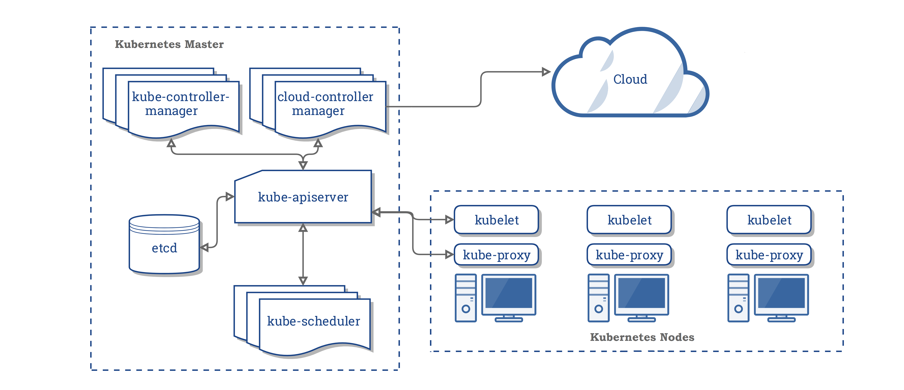

# Kubernetes ecosystem

## Index

- What is Kubernetes?
- Kubernetes architecture
- Kubernetes in the developer environment
- Kubernetes CLI
- YAML
- HA Clusters

## What is Kubernetes?

Kubernetes (commonly stylized as k8s) is an open-source container-orchestration system 
for automating application deployment, scaling, and management.

## Kubernetes architecture

- Master Components
  - kube-apiserver
  - etcd
  - kube-scheduler
  - kube-controller-manager
  - cloud-controller-manager
- Node Components
  - kubelet
  - kube-proxy
  - Container Runtime

https://kubernetes.io/docs/concepts/overview/components/

## Kubernetes in the development environment
 
- [kubectl](kubectl.md)
- [minikube](minikube.md) / microk8s

## HA Kubernetes clusters

https://kubernetes.io/docs/setup/production-environment/tools/kubeadm/high-availability/

https://kubernetes.io/blog/2019/11/26/running-kubernetes-locally-on-linux-with-microk8s/
https://ubuntu.com/blog/kubernetes-on-mac-how-to-set-up
